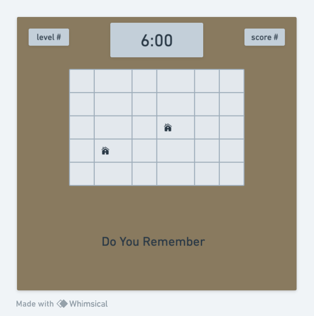

# Readme

### Name of the Game: "Do You Remember"
 
## Decscription
This is a memory game made in javascript, html, and css. This memory game 
 will include a board of different items to click on. When 
 a pair is clicked that match they stay open but when 
they dont match they cover them selves back. For every click you make, you receive point 
and the objective is to have the least amount of points.

### MVP Features - Mininum Viable Product
- [ ] Move or hover motion to respond for each item 
- [ ] Move the different items on the board 
- [ ] Have different levels bassed on the amount of time to finish/ or the amount of objects 
- [ ] Have timer
- [ ] Have a point system
### PMVP Features - Post Minimum Viable Product  
- [ ] Have a score counter
- [ ] Having Sound Effects
- [ ] Having Music
- [ ] Having constant motion in background
  
 
## Wireframes
